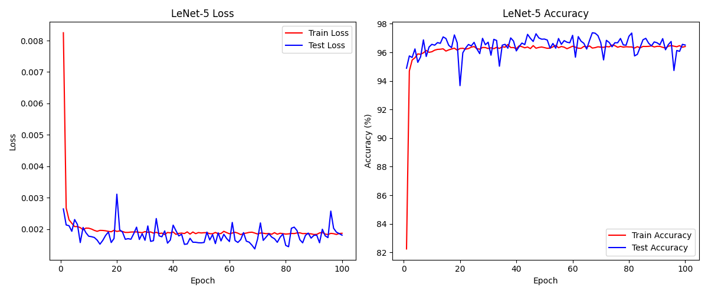
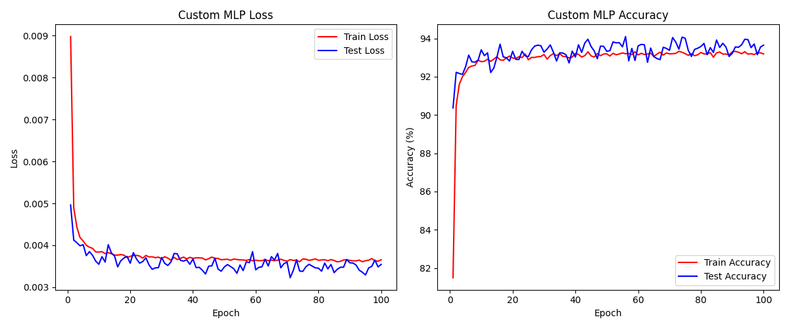

# 24_ANN_DL HW2 REPORT
Submitting HW2 in ANN and DL Lecture 2024

# Requirements 2 : Comparison parameters between LeNet-5 vs Custom MLP
LeNet-5 Architecture

LeNet-5 is a convolutional neural network that includes two convolutional layers followed by three fully connected layers. Here's a breakdown of the number of parameters (Weights + Bias) for each layer:

Layer 1. Conv1  : 1 x 6 x 5 x 5 + 6     = 156
Layer 2. Conv2  : 6 x 16 x 5 x 5 + 16   = 2,416
Layer 3. FC1    : 400 x 120 + 120       = 48,120
Layer 4. FC2    : 120 x 84 + 84         = 10,164
Layer 5. FC3    : 84 x 10 + 10          = 850

Total parameters for LeNet-5 = 61,706

Custome MLP Architecture

The custom MLP consists of three fully connected layers. Here's a breakdown of the number of parameters (Weights + Bias) for each layer:

Layer 1. Conv1  : 784 x 70 + 70         = 54,950
Layer 2. Conv2  : 70 x 20 + 20          = 1,420
Layer 3. FC1    : 20 x 10 + 10          = 210

Total parameters for Custom MLP = 56,580

# Requirements 4 : 
This report evaluates the performance of two neural network models, LeNet-5 and Custom MLP, during their training and validation processes. A comparative analysis was conducted by examining the trends of loss values and accuracy.

Result of LeNet-5

The training loss for the LeNet-5 model decreased sharply at the beginning and then stabilized. The training accuracy continually increased, achieving high levels. Both validation loss and accuracy showed patterns similar to the training results, indicating successful generalization of the model.

Result of Custom MLP

For the Custom MLP model, the training loss decreased rapidly before stabilizing at a certain level. The training accuracy was maintained at a relatively high level, and both validation loss and accuracy also showed trends very similar to the trianing process.

Conclusion

Both models showed stable learning, with LeNet-5 showing slightly better generalization performance. However, the Custom MLP model also demonstrated competitive accuracy, which is quite effective given its structural simplicity.

# Requirements 5 : 

The LeNet-5 model exhibited better predictive performance compared to the custom MLP model. This suggests that the complex structure and image feature learning capability of LeNet-5 contribute to higher predictive accuracy. Nevertheless, the custom MLP model maintains competitive accuracy despite its structural simplicity and offers the benefits of faster processing speed and lower computational costs.

# Requirements 6 : 

Employing 2 techniques

1. Weight Decay in SGD

File            : 'main.py'
Purpose         : Regularization via weight decay
Code snippet    : optimizer = optim.SGD(model.parameters(), lr=0.01, momentum=0.9, weight_decay=0.01)

2. Data Augmentation

File            : 'dataset.py'
Purpose         : Enhancing the model's ability to generalize to new data by introducing variety in the training dataset through random horizontal flips and rotations.
Code snippet    : self.transform = transforms.Compose([transforms.RandomHorizontalFlip(), transforms.RandomRotation(10), transforms.ToTensor(), transforms.Normalize(mean=0.1307, std=0.3081)])