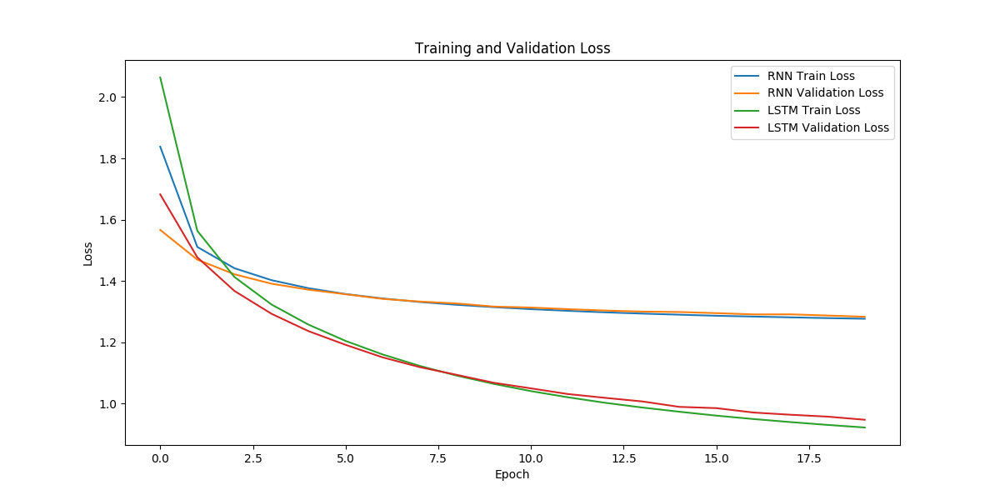

# 24_ANN_DL HW3 REPORT
Submitting HW3 in ANN and DL Lecture 2024

# Requirements 4: Average Loss for Training and Validation


# Requirements 6:

## Experiment Setup

- **Dataset**: Shakespeare text dataset
- **Model**: LSTM model
- **Temperature Parameters**: 0.5, 1.0, 2.0, 4.0, 8.0, 16.0, 32.0, 64.0, 100.0
- **Seed Text**: "The future belongs to those who believe in the beauty of their dreams."

### 1. T = 0.5
```
The future belongs to those who believe in the beauty of their dreams.
But keep not sent not make to Losdant with such followed to speak for the world,
Thou shalt to send
```
- **Characteristics**: The text is very coherent, grammatically correct, and easy to read.
- **Analysis**: The model predicts the next character with high confidence, resulting in consistent and predictable output. However, the diversity is low, and repetitive patterns may appear.

### 2. T = 1.0
```
The future belongs to those who believe in the beauty of their dreams.
But, by God's Vopinone us from his citizens?

CORIOLANUS:
Ha!

All:
Content, considerance.

MARCIUS
```
- **Characteristics**: The balance between coherence and diversity is well-maintained. The text is relatively grammatical and exhibits varied expressions.
- **Analysis**: This temperature setting generally provides optimal results, achieving a good balance between creativity and coherence.

### 3. T = 2.0
```
The future belongs to those who believe in the beauty of their dreams.
Him iper to give a
pleccecarman; hail done ismure-glonked.'

HASdisin:
My executions argy. Prow so,
```
- **Characteristics**: Increased diversity, but grammatical coherence starts to degrade. More creative expressions appear.
- **Analysis**: The higher temperature allows for more variety, but the resulting text may become ambiguous or grammatically incorrect.

### 4. T = 4.0 and Above
```
The future belongs to those who believe in the beauty of their dreams.--gid?
Yeibivioces capth
escanst; tire? Lacku Hitly!
Wize inwRowaf: te's Comm
LiRINGt:
Joos! poon!
h
```
- **Characteristics**: The text becomes highly diverse but lacks grammatical coherence and meaning. The output appears almost random.
- **Analysis**: Excessively high temperatures result in the model losing confidence in predicting the next character, leading to nearly random text generation.

### 5. Conclusion
The temperature parameter significantly influences text generation. The summary of the results is as follows:

- **Low Temperature (0.5)**: The model predicts the next character with high confidence, producing consistent and predictable output. However, the creativity is limited.
- **Medium Temperature (1.0)**: The model maintains a good balance between creativity and coherence. This setting generally generates the best results.
- **High Temperature (2.0 and above)**: The model generates highly creative but less coherent text. The output becomes grammatically incorrect and nearly random at very high temperatures.

### 6. Recommended Temperature Parameter
Based on the experiment results, a temperature parameter of 1.0 is recommended as it provides the best balance between coherence and diversity, generating the most optimal text generation outcomes.
